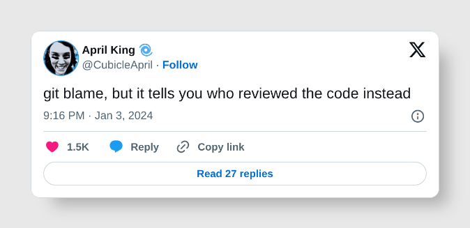

# git-blame-reviewer

A Git tool that mimics the behavior of `git blame` but shows GitHub pull request or GitLab merge request approvers for each line of code instead of the original commit authors.

> Inspired by [@CubicleApril](https://x.com/CubicleApril/status/1742656227455259066):
>
> 

## Features

- 🔍 Shows who approved the changes for each line of code
- ⏰ Displays approval timestamps instead of commit timestamps
- 📋 **Identical interface** to `git blame` - same command-line arguments and output format
- 🎨 Supports both human-readable and porcelain output formats
- 🚀 Built with Go - single binary, no external dependencies
- ⚡ Optimized with commit-level caching to minimize API calls
- 🌐 **Supports both GitHub and GitLab** - automatically detects repository type
- 🏢 Works with **self-hosted GitLab** instances

## Installation

### From Source

```bash
git clone <repository-url>
cd git-blame-reviewer
make build
```

### Binary

The compiled binary will be available as `git-blame-reviewer`.

## Usage

**git-blame-reviewer uses the exact same command-line interface as git blame:**

### Basic Usage

```bash
git-blame-reviewer src/main.go
```

### With Line Range

```bash
git-blame-reviewer -L 10,20 src/main.go
```

### Porcelain Format (Machine-Readable)

```bash
git-blame-reviewer -porcelain src/main.go
```

### Show Email Addresses

```bash
git-blame-reviewer -show-email src/main.go
```

### Command Line Options

- `-L <start>,<end>` - Show only lines in given range (same as git blame)
- `-porcelain` - Show in a format designed for machine consumption
- `-show-email` - Show author email instead of author name  
- `-help` - Show help message

**Note:** The file path is provided as a positional argument, just like `git blame`.

## API Tokens

### GitHub Token

You'll need a GitHub personal access token with `repo` scope to access pull request information.

1. Go to GitHub Settings > Developer settings > Personal access tokens  
2. Generate new token with `repo` scope

### GitLab Token

You'll need a GitLab personal access token with `read_api` and `read_repository` scopes.

1. Go to GitLab Settings > Access Tokens
2. Generate new token with `read_api` and `read_repository` scopes

### Usage:

### GitHub Repositories

```bash
export GITHUB_TOKEN=ghp_xxxxxxxxxxxx
git-blame-reviewer src/main.go
```

### GitLab Repositories

```bash
export GITLAB_TOKEN=glpat_xxxxxxxxxxxx
git-blame-reviewer src/main.go
```

### Self-hosted GitLab

```bash
export GITLAB_TOKEN=glpat_xxxxxxxxxxxx
git-blame-reviewer src/main.go  # Works automatically with self-hosted instances
```

The tool automatically detects whether your repository is hosted on GitHub or GitLab based on the remote origin URL and uses the appropriate token.

## Development

### Prerequisites

- Go 1.25.1+
- Make
- golangci-lint (install with `make install-tools`)

### Building

```bash
make build
```

### Testing

```bash
make test
make test-coverage  # with coverage report
```

### Linting

```bash
make lint
```

### All Checks

```bash
make check  # runs tests + linting
```

## How It Works

1. **Git Repository Detection** - Finds the git repository root and validates it's a git directory
2. **Repository Type Detection** - Automatically detects GitHub vs GitLab from remote origin URL  
3. **Repository Info Extraction** - Extracts owner/repository name from git remote origin
4. **Git Blame Execution** - Runs `git blame` on the specified file to get commit hashes per line  
5. **API Integration** - For each unique commit hash:
   - **GitHub**: Queries GitHub API to find associated pull request and approvals
   - **GitLab**: Queries GitLab API to find associated merge request and approvals
   - Caches results to avoid duplicate API calls
6. **Output Formatting** - Displays results in the same format as `git blame`, but with:
   - PR/MR approver name instead of commit author
   - PR/MR approval timestamp instead of commit timestamp
   - Falls back to original commit info if no PR/MR/approval found

## Output Format

The output format is identical to `git blame`:

```
a1b2c3d4 (Jane Smith    2023-12-01 14:30:25  1) package main
b2c3d4e5 (Bob Wilson    2023-12-01 09:15:10  2) 
c3d4e5f6 (Alice Johnson 2023-11-30 16:45:30  3) import "fmt"
```

Where:
- `a1b2c3d4` - Commit hash (shortened)
- `Jane Smith` - **PR/MR approver name** (not commit author)
- `2023-12-01 14:30:25` - **PR/MR approval timestamp** (not commit timestamp)
- `1` - Line number
- `package main` - Line content

## Supported Platforms

| Platform | URL Format | Token Type | Scope Required |
|----------|------------|------------|----------------|
| GitHub.com | `github.com/owner/repo` | Personal Access Token | `repo` |
| GitLab.com | `gitlab.com/owner/repo` | Personal Access Token | `read_api`, `read_repository` |
| Self-hosted GitLab | `gitlab.example.com/owner/repo` | Personal Access Token | `read_api`, `read_repository` |

## License

MIT

## Contributing

1. Fork the repository
2. Create a feature branch
3. Make your changes with tests
4. Run `make check` to ensure quality
5. Submit a pull request